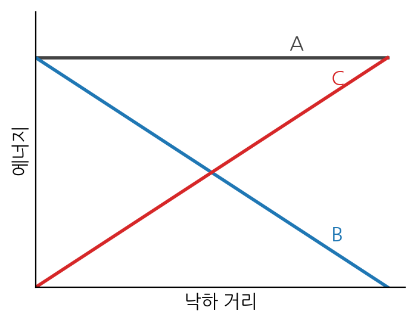
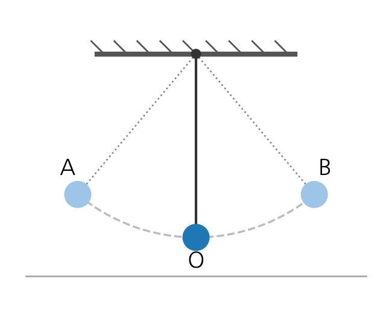
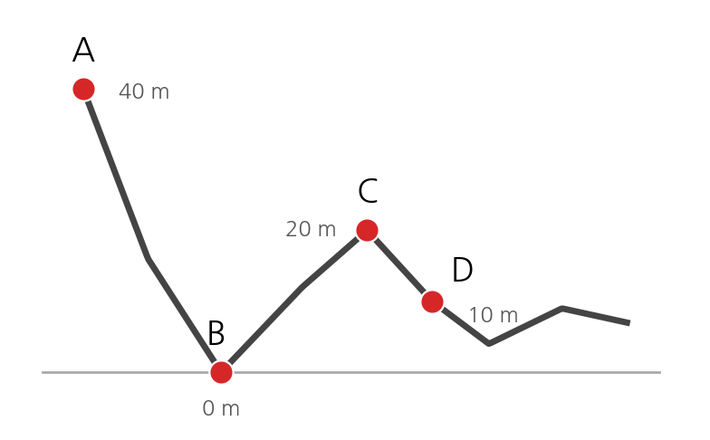
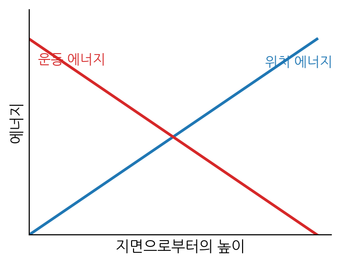
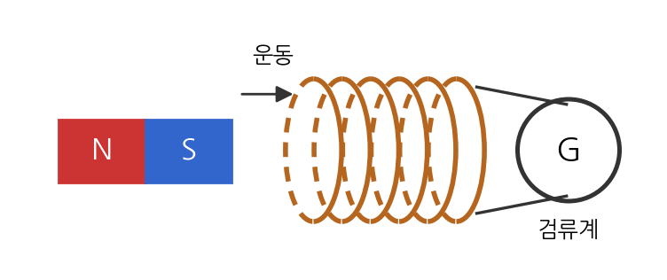
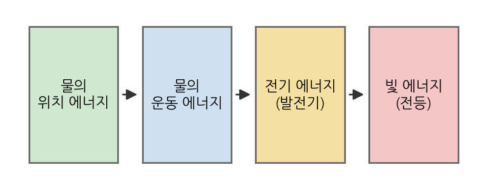

# 2026학년도 과학 모의고사 (중학교 3학년)

**Ⅵ. 에너지 전환과 보존**

※ 문항 수 : 40문항 (전 문항 5지선다 객관식)  
※ 중력에 의한 위치 에너지는 9.8 × 질량(kg) × 높이(m) [J] 로 계산하며, 공기 저항과 마찰은 무시한다.  
※ <보기>가 제시된 문항은 옳은 것을 모두 고른 조합을 선택하세요.  

---

## 1. 역학적 에너지 전환과 보존

**1.** 중력에 의한 위치 에너지에 대한 설명으로 옳은 것은?

① 위치 에너지의 크기는 기준면을 어디로 정하든 항상 같다.  
② 같은 높이에 있는 물체라도 기준면을 어디로 정하느냐에 따라 위치 에너지의 값이 달라진다.  
③ 질량이 일정할 때 기준면으로부터 높이가 높아질수록 위치 에너지는 작아진다.  
④ 위치 에너지는 물체의 질량과 관계없이 높이에 의해서만 정해진다.  
⑤ 위치 에너지의 단위로는 힘의 단위인 N(뉴턴)을 사용한다.  

**2.** 표는 질량과 낙하 높이를 다르게 하여 추를 모래 위의 말뚝에 떨어뜨린 뒤, 말뚝이 박힌 깊이를 측정한 결과이다. 이로부터 알 수 있는 사실로 옳은 것만을 <보기>에서 있는 대로 고른 것은?

| 실험 | 추의 질량(kg) | 낙하 높이(m) | 말뚝이 박힌 깊이(cm) |
| --- | --- | --- | --- |
| A | 1 | 10 | 2 |
| B | 2 | 10 | 4 |
| C | 1 | 20 | 4 |
| D | 2 | 20 | 8 |

> **< 보기 >**  
> ㄱ. A와 B를 비교하면 위치 에너지는 추의 질량에 비례함을 알 수 있다.  
> ㄴ. A와 C를 비교하면 위치 에너지는 낙하 높이에 비례함을 알 수 있다.  
> ㄷ. 추의 위치 에너지가 클수록 말뚝이 박힌 깊이가 깊어진다.

① ㄱ  
② ㄷ  
③ ㄱ, ㄴ  
④ ㄴ, ㄷ  
⑤ ㄱ, ㄴ, ㄷ  

**3.** 질량이 3 kg인 물체가 지면으로부터 높이 2 m인 책상 위에 놓여 있다. 지면을 기준면으로 할 때, 이 물체의 위치 에너지는?

① 6 J  
② 29.4 J  
③ 58.8 J  
④ 60 J  
⑤ 588 J  

**4.** 표는 수레의 질량과 속력을 다르게 하여 수평면에서 나무도막에 충돌시킨 뒤, 나무도막이 밀려난 거리를 측정한 결과이다. 이로부터 알 수 있는 사실로 옳은 것만을 <보기>에서 있는 대로 고른 것은?

| 실험 | 수레의 질량(kg) | 속력(m/s) | 나무도막이 밀려난 거리(cm) |
| --- | --- | --- | --- |
| A | 1 | 2 | 4 |
| B | 2 | 2 | 8 |
| C | 1 | 4 | 16 |

> **< 보기 >**  
> ㄱ. A와 B를 비교하면 운동 에너지는 질량에 비례함을 알 수 있다.  
> ㄴ. A와 C를 비교하면 속력이 2배가 될 때 운동 에너지는 4배가 됨을 알 수 있다.  
> ㄷ. 운동 에너지는 속력에 정비례한다.

① ㄱ  
② ㄷ  
③ ㄱ, ㄴ  
④ ㄴ, ㄷ  
⑤ ㄱ, ㄴ, ㄷ  

**5.** 질량이 2 kg인 물체가 4 m/s의 속력으로 운동하고 있다. 이에 대한 설명으로 옳은 것은?

① 이 물체의 운동 에너지는 16 J이다.  
② 이 물체의 운동 에너지는 32 J이다.  
③ 속력이 2배가 되면 운동 에너지도 2배가 된다.  
④ 속력이 2배가 되면 운동 에너지는 8배가 된다.  
⑤ 질량이 2배가 되면 운동 에너지는 4배가 된다.  

**6.** 역학적 에너지에 대한 설명으로 옳지 않은 것은?

① 역학적 에너지는 위치 에너지와 운동 에너지의 합이다.  
② 공기 저항이나 마찰이 없으면 운동하는 동안 역학적 에너지는 일정하게 보존된다.  
③ 물체가 낙하할 때에는 위치 에너지가 운동 에너지로 전환된다.  
④ 물체가 위로 올라갈 때에는 운동 에너지가 위치 에너지로 전환된다.  
⑤ 역학적 에너지가 보존될 때 위치 에너지와 운동 에너지는 각각 항상 일정하게 유지된다.  

**7.** 그림은 가만히 놓아 떨어뜨린 물체의 낙하 거리에 따른 세 가지 에너지 A, B, C를 나타낸 것이다. 이에 대한 설명으로 옳은 것만을 <보기>에서 있는 대로 고른 것은?

> **< 보기 >**  
> ㄱ. A는 역학적 에너지이며 낙하하는 동안 일정하다.  
> ㄴ. 감소한 위치 에너지 B의 양과 증가한 운동 에너지 C의 양은 서로 같다.  
> ㄷ. 지면에 가까워질수록 운동 에너지 C는 점점 작아진다.

① ㄱ  
② ㄷ  
③ ㄱ, ㄴ  
④ ㄴ, ㄷ  
⑤ ㄱ, ㄴ, ㄷ  

**8.** 질량이 4 kg인 물체를 높이 5 m에서 가만히 놓아 떨어뜨렸다. 공기 저항을 무시할 때, 물체가 지면에 도달하는 순간의 운동 에너지는?

① 20 J  
② 49 J  
③ 98 J  
④ 196 J  
⑤ 392 J  

**9.** 질량이 m인 물체를 높이 H에서 가만히 놓아 떨어뜨렸다. 물체가 떨어지기 시작한 곳에서 H의 1/4 만큼 내려온 지점(지면으로부터 높이가 3/4 H인 지점)에서, 물체의 위치 에너지와 운동 에너지의 비(위치 에너지 : 운동 에너지)는? (공기 저항 무시)

① 1 : 3  
② 1 : 1  
③ 3 : 1  
④ 2 : 1  
⑤ 4 : 1  

**10.** 물체를 지면에서 연직 위로 던져 올렸다. 올라가는 동안의 에너지 변화에 대한 설명으로 옳은 것만을 <보기>에서 있는 대로 고른 것은? (공기 저항 무시)

> **< 보기 >**  
> ㄱ. 올라가는 동안 운동 에너지가 위치 에너지로 전환된다.  
> ㄴ. 최고점에서 운동 에너지는 0이고 위치 에너지가 최대이다.  
> ㄷ. 최고점에서 물체의 역학적 에너지는 0이 된다.

① ㄱ  
② ㄷ  
③ ㄱ, ㄴ  
④ ㄴ, ㄷ  
⑤ ㄱ, ㄴ, ㄷ  

**11.** 그림은 마찰과 공기 저항을 무시할 수 있는 진자가 A → O → B로 왕복 운동하는 모습이다. A와 B는 높이가 같은 최고점, O는 최저점이다. 이에 대한 설명으로 옳은 것만을 <보기>에서 있는 대로 고른 것은?

> **< 보기 >**  
> ㄱ. A에서 O로 갈 때 위치 에너지가 운동 에너지로 전환된다.  
> ㄴ. 운동 에너지가 가장 큰 지점은 최저점 O이다.  
> ㄷ. B에서의 위치 에너지는 A에서의 위치 에너지와 같다.

① ㄱ  
② ㄷ  
③ ㄱ, ㄴ  
④ ㄴ, ㄷ  
⑤ ㄱ, ㄴ, ㄷ  

**12.** 질량이 0.5 kg인 진자를 최저점으로부터 높이가 0.8 m인 지점에서 가만히 놓았다. 진자가 최저점을 지날 때의 운동 에너지는? (공기 저항과 마찰 무시)

① 0.4 J  
② 1.96 J  
③ 3.92 J  
④ 4 J  
⑤ 7.84 J  

**13.** 그림은 마찰과 공기 저항을 무시할 수 있는 롤러코스터의 운동 경로이다. 수레는 가장 높은 A 지점에서 정지 상태로 출발하며, 각 지점의 높이는 A 40 m, B 0 m, C 20 m, D 10 m이다. 이에 대한 설명으로 옳은 것만을 <보기>에서 있는 대로 고른 것은?

> **< 보기 >**  
> ㄱ. 운동 에너지가 가장 큰 지점은 B이다.  
> ㄴ. 위치 에너지가 가장 큰 지점은 A이다.  
> ㄷ. C와 D 중에서 수레의 속력이 더 빠른 지점은 D이다.

① ㄱ  
② ㄷ  
③ ㄱ, ㄴ  
④ ㄴ, ㄷ  
⑤ ㄱ, ㄴ, ㄷ  

**14.** 그림과 같이 마찰이 없는 빗면의 높이 h인 곳에서 물체를 가만히 놓아 빗면을 따라 내려오게 하였다. 이에 대한 설명으로 옳은 것은? (공기 저항 무시)

> [그림] 마찰이 없는 빗면 위 높이 h인 지점에서 물체를 가만히 놓으면  
> 물체가 빗면을 따라 미끄러져 내려온다.

① 빗면을 내려오는 동안 물체의 위치 에너지는 점점 증가한다.  
② 빗면을 내려오는 동안 물체의 운동 에너지는 점점 증가한다.  
③ 빗면 바닥에서의 운동 에너지는 처음 위치 에너지보다 크다.  
④ 마찰이 없어도 내려오는 동안 역학적 에너지는 점점 감소한다.  
⑤ 출발 높이가 같아도 빗면의 기울기가 완만하면 바닥에서의 운동 에너지는 작아진다.  

**15.** 질량이 1 kg인 공을 지면에서 연직 위로 던져 올렸더니, 최고점에서 공의 위치 에너지가 49 J이었다(지면 기준). 이에 대한 설명으로 옳은 것만을 <보기>에서 있는 대로 고른 것은? (공기 저항 무시)

> **< 보기 >**  
> ㄱ. 최고점의 높이는 5 m이다.  
> ㄴ. 공을 던지는 순간의 운동 에너지는 49 J이다.  
> ㄷ. 최고점에서 공의 역학적 에너지는 0이다.

① ㄱ  
② ㄷ  
③ ㄱ, ㄴ  
④ ㄴ, ㄷ  
⑤ ㄱ, ㄴ, ㄷ  

**16.** 그림은 자유 낙하 하는 물체의 ‘지면으로부터의 높이’에 따른 위치 에너지와 운동 에너지를 나타낸 것이다. 이에 대한 설명으로 옳은 것만을 <보기>에서 있는 대로 고른 것은?

> **< 보기 >**  
> ㄱ. 위치 에너지는 높이에 비례하여 커진다.  
> ㄴ. 높이가 높은 지점일수록 운동 에너지는 작다.  
> ㄷ. 어느 높이에서나 위치 에너지와 운동 에너지의 합은 일정하다.

① ㄱ  
② ㄷ  
③ ㄱ, ㄴ  
④ ㄴ, ㄷ  
⑤ ㄱ, ㄴ, ㄷ  

**17.** 표는 질량이 2 kg인 물체를 높이 10 m에서 가만히 놓아 떨어뜨릴 때 각 지점에서의 에너지를 정리한 것이다. (가)~(다)에 들어갈 값으로 옳은 것은? (공기 저항 무시)

| 지점 | 높이(m) | 위치 에너지(J) | 운동 에너지(J) |
| --- | --- | --- | --- |
| P | 10 | 196 | (가) |
| Q | 5 | (나) | 98 |
| R | 0 | 0 | (다) |

① (가) 0 — (나) 98 — (다) 196  
② (가) 0 — (나) 49 — (다) 98  
③ (가) 98 — (나) 98 — (다) 98  
④ (가) 0 — (나) 196 — (다) 196  
⑤ (가) 196 — (나) 98 — (다) 0  

**18.** 실제로 공기 저항이나 마찰이 있는 상황에서 물체가 운동할 때의 에너지에 대한 설명으로 옳은 것은?

① 실제로 떨어지는 물체는 역학적 에너지가 점점 증가한다.  
② 마찰이 있으면 줄어든 역학적 에너지는 완전히 사라져 없어진다.  
③ 공기 저항이 있으면 역학적 에너지의 일부가 열에너지나 소리 에너지로 전환된다.  
④ 마찰이 있어도 물체의 역학적 에너지는 항상 일정하게 보존된다.  
⑤ 공기 저항은 운동 에너지만 줄일 뿐 위치 에너지에는 전혀 영향을 주지 않는다.  

**19.** 다음은 역학적 에너지의 전환과 관련된 현상을 설명한 것이다. 설명이 옳지 않은 것은? (공기 저항·마찰 무시)

① 떨어지는 빗방울은 위치 에너지가 운동 에너지로 전환된다.  
② 위로 쏘아 올린 폭죽은 올라가는 동안 운동 에너지가 위치 에너지로 전환된다.  
③ 트램펄린에서 튀어 오른 사람이 최고점에 있을 때 운동 에너지가 가장 크다.  
④ 그네가 가장 낮은 곳을 지날 때 운동 에너지가 가장 크다.  
⑤ 다이빙 선수가 높은 다이빙대에서 떨어질 때 위치 에너지가 운동 에너지로 전환된다.  

**20.** 질량이 5 kg인 물체를 높이 4 m에서 가만히 놓아 떨어뜨렸다. 물체가 지면으로부터 높이 1 m인 지점을 지날 때의 운동 에너지는? (공기 저항 무시)

① 49 J  
② 98 J  
③ 147 J  
④ 196 J  
⑤ 245 J  

## 2. 전기 에너지의 발생과 전환

**21.** 그림과 같이 코일과 검류계를 연결하고 막대자석을 코일에 넣었다 뺐다 하였다. 이에 대한 설명으로 옳은 것만을 <보기>에서 있는 대로 고른 것은?

> **< 보기 >**  
> ㄱ. 자석을 코일에 가까이 하거나 멀리 할 때 코일에 전류가 흐른다.  
> ㄴ. 이처럼 자석의 운동으로 코일에 전류가 흐르는 현상을 전자기 유도라 하고, 이때 흐르는 전류를 유도 전류라 한다.  
> ㄷ. 자석을 코일 속에 넣은 채 가만히 두어도 전류가 계속 흐른다.

① ㄱ  
② ㄷ  
③ ㄱ, ㄴ  
④ ㄴ, ㄷ  
⑤ ㄱ, ㄴ, ㄷ  

**22.** 표는 코일에 검류계를 연결하고 막대자석을 여러 방법으로 움직였을 때 검류계 바늘의 움직임을 나타낸 것이다. 이에 대한 설명으로 옳은 것은?

| 자석의 운동 | 검류계 바늘 |
| --- | --- |
| N극을 코일에 가까이 | 오른쪽으로 움직임 |
| N극을 코일에서 멀리 | 왼쪽으로 움직임 |
| N극을 더 빠르게 가까이 | 오른쪽으로 더 크게 움직임 |

① 자석을 가까이 할 때와 멀리 할 때 유도 전류의 방향은 서로 같다.  
② 코일에 가까이 하는 자석의 극을 반대로 하면 유도 전류의 방향도 반대가 된다.  
③ 자석을 빠르게 움직일수록 유도 전류는 약해진다.  
④ 자석을 움직이지 않아도 유도 전류가 흐른다.  
⑤ 유도 전류의 방향은 자석의 운동 방향과 관계가 없다.  

**23.** 코일에 흐르는 유도 전류의 세기를 더 크게 하는 방법으로 옳은 것만을 <보기>에서 있는 대로 고른 것은?

> **< 보기 >**  
> ㄱ. 더 센 자석을 사용한다.  
> ㄴ. 자석을 더 빠르게 움직인다.  
> ㄷ. 코일을 더 많이 감는다.

① ㄱ  
② ㄷ  
③ ㄱ, ㄴ  
④ ㄴ, ㄷ  
⑤ ㄱ, ㄴ, ㄷ  

**24.** 전자기 유도에서 유도 전류의 세기에 대한 설명으로 옳은 것은?

① 자석이 코일 속에 정지해 있어도 센 유도 전류가 흐른다.  
② 자석을 빠르게 움직일수록 유도 전류가 세진다.  
③ 자석과 코일이 같은 방향으로 같은 속력으로 함께 움직이면 유도 전류가 가장 세다.  
④ 유도 전류의 세기는 자석의 세기와 관계가 없다.  
⑤ 코일의 감은 수가 적을수록 유도 전류가 세진다.  

**25.** 발전기에 대한 설명으로 옳은 것은?

① 발전기는 전기 에너지를 운동 에너지로 바꾸는 장치이다.  
② 발전기는 전자기 유도를 이용하여 전기 에너지를 만든다.  
③ 발전기는 자석 없이 코일만으로 전기를 만든다.  
④ 발전기에서는 코일을 가만히 두어도 전기가 계속 만들어진다.  
⑤ 발전기와 전동기는 에너지 전환 방향이 서로 같다.  

**26.** 여러 가지 발전 방식에서의 에너지 전환에 대한 설명으로 옳은 것만을 <보기>에서 있는 대로 고른 것은?

> **< 보기 >**  
> ㄱ. 수력 발전은 높은 곳에 있는 물의 위치 에너지를 이용한다.  
> ㄴ. 풍력 발전은 바람의 운동 에너지를 전기 에너지로 전환한다.  
> ㄷ. 수력·화력·풍력 발전은 모두 발전기를 회전시켜 전기 에너지를 얻는다.

① ㄱ  
② ㄷ  
③ ㄱ, ㄴ  
④ ㄴ, ㄷ  
⑤ ㄱ, ㄴ, ㄷ  

**27.** 표는 여러 전기 기구에서 전기 에너지가 주로 전환되는 에너지를 나타낸 것이다. (가)~(라) 중 옳지 않은 것은?

| 전기 기구 | 주로 전환되는 에너지 |
| --- | --- |
| (가) 전기난로 | 열 에너지 |
| (나) 선풍기 | 운동(역학적) 에너지 |
| (다) 형광등 | 빛 에너지 |
| (라) 스피커 | 화학 에너지 |

① (가)  
② (나)  
③ (다)  
④ (라)  
⑤ 없음  

**28.** 소비 전력에 대한 설명으로 옳은 것은?

① 소비 전력은 1초 동안 사용하는 전기 에너지의 양이다.  
② 소비 전력의 단위로는 J(줄)을 사용한다.  
③ 1 W는 1시간 동안 1 J의 전기 에너지를 사용하는 것을 뜻한다.  
④ 소비 전력이 클수록 같은 시간 동안 사용하는 전기 에너지가 적다.  
⑤ 소비 전력과 사용 시간은 항상 반비례한다.  

**29.** 어떤 전기 기구가 2분 동안 6000 J의 전기 에너지를 소비하였다. 이 전기 기구의 소비 전력은?

① 30 W  
② 50 W  
③ 100 W  
④ 3000 W  
⑤ 12000 W  

**30.** 소비 전력이 100 W인 전구를 5시간 동안 사용하였을 때 소비한 전력량은?

① 20 Wh  
② 100 Wh  
③ 500 Wh  
④ 5000 Wh  
⑤ 50000 Wh  

**31.** 표는 네 가지 전기 기구의 소비 전력과 하루 사용 시간을 나타낸 것이다. 하루 동안 소비하는 전력량이 가장 큰 기구는?

| 전기 기구 | 소비 전력(W) | 하루 사용 시간(h) |
| --- | --- | --- |
| A 전구 | 50 | 10 |
| B TV | 100 | 4 |
| C 냉장고 | 40 | 24 |
| D 전자레인지 | 1000 | 0.5 |

① A  
② B  
③ C  
④ D  
⑤ A와 D가 서로 같다  

**32.** 전력량에 대한 설명으로 옳은 것은?

① 전력량은 소비 전력을 사용 시간으로 나눈 값이다.  
② 같은 전기 기구라도 오래 사용할수록 소비하는 전력량이 커진다.  
③ 소비 전력이 다른 기구라도 사용 시간이 같으면 전력량은 모두 같다.  
④ 1 kWh는 100 Wh와 같다.  
⑤ 전력량의 단위로는 W를 사용한다.  

**33.** 에너지 보존 법칙에 대한 설명으로 옳은 것은?

① 에너지는 전환될 때마다 일부가 새로 만들어진다.  
② 에너지는 한 형태에서 다른 형태로 전환되며, 전환 전후 에너지의 총량은 일정하게 보존된다.  
③ 전기 기구를 사용하면 우주 전체의 에너지 총량이 점점 줄어든다.  
④ 에너지는 전환 과정에서 모두 사라져 없어질 수 있다.  
⑤ 에너지 보존 법칙은 역학적 에너지에만 성립한다.  

**34.** 같은 양의 전기 에너지를 공급했을 때 빛 에너지로 전환되는 비율이 백열등 A는 약 10 %, LED 전등 B는 약 50 %였다. 이에 대한 설명으로 옳은 것은?

① 같은 밝기를 내는 데 A가 B보다 전기 에너지를 적게 쓴다.  
② B가 A보다 빛으로 전환되는 비율이 높으므로 에너지 효율이 높다.  
③ A에서는 공급한 전기 에너지가 모두 빛 에너지로 전환된다.  
④ B에서는 열이 전혀 발생하지 않는다.  
⑤ 에너지 효율이 높을수록 같은 밝기를 내는 데 더 많은 전기 에너지가 필요하다.  

**35.** 전기 기구를 사용할 때 일어나는 에너지 전환에 대한 설명으로 옳은 것만을 <보기>에서 있는 대로 고른 것은?

> **< 보기 >**  
> ㄱ. 공급된 전기 에너지의 일부는 의도하지 않은 열에너지 등으로 전환된다.  
> ㄴ. 전환된 여러 에너지를 모두 합하면 공급한 전기 에너지와 같다.  
> ㄷ. 전구에서 발생하는 열은 에너지가 사라진 것이므로 에너지 보존 법칙에 어긋난다.

① ㄱ  
② ㄷ  
③ ㄱ, ㄴ  
④ ㄴ, ㄷ  
⑤ ㄱ, ㄴ, ㄷ  

**36.** 건전지를 넣은 손전등을 켰을 때 일어나는 에너지 전환 과정을 순서대로 옳게 나타낸 것은?

① 화학 에너지 → 전기 에너지 → 빛 에너지(와 열에너지)  
② 전기 에너지 → 화학 에너지 → 빛 에너지  
③ 빛 에너지 → 전기 에너지 → 화학 에너지  
④ 화학 에너지 → 빛 에너지 → 전기 에너지  
⑤ 운동 에너지 → 전기 에너지 → 빛 에너지  

**37.** 그림은 수력 발전소에서 만든 전기로 가정에서 전등을 켜기까지의 과정을 나타낸 것이다. 각 단계의 에너지 전환에 대한 설명으로 옳은 것만을 <보기>에서 있는 대로 고른 것은?

> **< 보기 >**  
> ㄱ. 댐에 저장된 물의 위치 에너지가 떨어지면서 운동 에너지로 전환된다.  
> ㄴ. 발전기에서는 물의 운동 에너지가 전기 에너지로 전환된다.  
> ㄷ. 전등에서는 전기 에너지가 빛 에너지로 전환된다.

① ㄱ  
② ㄷ  
③ ㄱ, ㄴ  
④ ㄴ, ㄷ  
⑤ ㄱ, ㄴ, ㄷ  

**38.** 소비 전력이 30 W인 선풍기를 2시간 동안 사용하였다. 이에 대한 설명으로 옳은 것은?

① 사용한 전력량은 60 Wh이다.  
② 사용한 전력량은 15 Wh이다.  
③ 선풍기는 전기 에너지를 주로 빛 에너지로 전환한다.  
④ 소비 전력이 클수록 같은 시간 동안 사용하는 전력량은 작아진다.  
⑤ 같은 선풍기를 4시간 사용하면 전력량은 절반이 된다.  

**39.** 다음 중 전자기 유도를 이용한 예로 보기 어려운 것은?

① 코일을 회전시켜 전기를 만드는 발전기  
② 소리의 진동으로 코일에 전류를 만드는 다이내믹 마이크  
③ 교통 카드나 휴대 전화의 무선(비접촉) 충전  
④ 금속이 가까이 오면 신호를 내는 금속 탐지기  
⑤ 니크롬선에 전류를 흘려 열을 내는 전기난로  

**40.** 에너지 전환과 보존에 대한 설명으로 옳은 것만을 <보기>에서 있는 대로 고른 것은?

> **< 보기 >**  
> ㄱ. 에너지는 여러 형태로 전환될 수 있으며, 전환 과정에서 에너지의 총량은 보존된다.  
> ㄴ. 발전기는 역학적 에너지를, 전동기는 전기 에너지를 다른 형태의 에너지로 전환하는 장치이다.  
> ㄷ. 우리가 사용하는 전기 에너지도 결국 다른 형태의 에너지가 전환되어 만들어진 것이다.

① ㄱ  
② ㄷ  
③ ㄱ, ㄴ  
④ ㄴ, ㄷ  
⑤ ㄱ, ㄴ, ㄷ  

― 문제 끝 ―